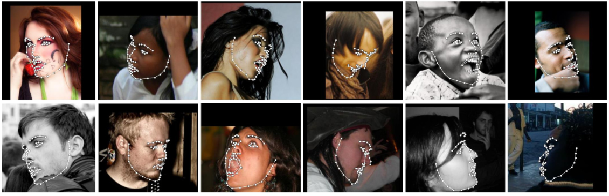

# Super Resolution Deepfakes

This project is mainly inspired by and based on [First Order Model for Image Animation](https://github.com/AliaksandrSiarohin/first-order-model) repository by [Aliaksandr Siarohin](https://github.com/AliaksandrSiarohin), which is itself based on the paper [First Order Motion Model for Image Animation](https://papers.nips.cc/paper/8935-first-order-motion-model-for-image-animation). This project also involves and benefits from [Face Recognition](https://github.com/1adrianb/face-alignment) repository by [Adrian Bulat](https://github.com/1adrianb), as well as [Fast SRGAN](https://github.com/HasnainRaz/Fast-SRGAN) repository by [Hasnain Raza](https://github.com/HasnainRaz). This project, aimed to achieve generation of high quality Super Resolution Deepfakes,  is a unification of all 3 repositories, applying some changes and improvements, in order to obtain a desired result. I strongly recommend to visit each of the repositories used in this project. 

# Changes and improvements that were made
* Connecting the pipelines of all the projects via one `main.py` file
* Creating a high-level jupyter notebook and .py files, in order to simplify usage for people without programming knowledge
* Fixed fps problem, before videos were outputed with 1.5x-3x duration, now duration is the same with the original
* Made offline loading of all the checkpoints and collected all of them into one directory
* Implemented lossless video output for Super Resolution option

# First Order Motion Model for Image Animation: Overview

The videos on the left show the driving videos. The top row on the right for each dataset shows the source images. The bottom row on the right contains the animated sequences with motion transferred from the driving video and object taken from the source image. A separate network was trained for each task.

## VoxCeleb Dataset

## Fashion Dataset

## MGIF Dataset


# Face Recognition: Overview

An accurate face alignment network, capable of detecting points in both 2D and 3D coordinates. It is built using FAN's state-of-the-art deep learning based face alignment method. 


Examples of detected 2D facial landmarks in pictures:



Examples of detected 3D facial landmarks in pictures:


# Fast-SRGAN: Overview

The goal of this repository is to enable real time super resolution for upsampling low resolution videos. Currently, the design follows the SR-GAN architecture. But instead of residual blocks, inverted residual blocks are employed for parameter efficiency and fast operation. This idea is somewhat inspired by Real time image enhancement GANs.

The training setup looks like the following diagram:

<p align="center">
  
</p>

Examples of how this works are presented here. Left shows the low resolution image, after 4x bicubic upsampling. Middle is the output of the model. Right is the actual high resolution image.

<p align="center">
  <b>384x384 to 1536x1536 Upsampling</b>
   
  <b>256x256 to 1024x1024 Upsampling</b>
  
  <b>128x128 to 512x512 Upsampling</b>
  
</p>

# How to use

Choose the .ipynb or .py file which suits you best and run it. There are the following parameters to tweak:

* `source_image` - name of the image which you would like to animate (example: `"image.jpg"`)
* `driving_video` - name of the video with animation (example: `"video.mp4"`)
* `cpu` - True if you would like to run the code on CPU, and choose False if you would like to run the code on GPU
* `improve` - True if you would like to upscale your resulting video to super resolution, False if you wouldn't like to upscale your resulting video to super resolution
* `best_frame` - internal parameter, which can make the resulting video better or worse, feel free play with it
* `relative` - internal parameter, which can make the resulting video better or worse, feel free play with it
* `adapt_movement_scale` - internal parameter, which can make the resulting video better or worse, feel free play with it
* `config` - configuration files, don't change them
* `checkpoint` - checkpoint files, don't change them

There are the following folders to put files in:

* `driving` - put here the video with animation
* `source` - put here the image which you would like to animate
* `videos` - resulting video will be saved here

# Installation

While not required, for optimal performance it is **highly** recommended to run this code using a CUDA enabled GPU.

Several ways of installation are provided. For all of them **you will need to download checkpoints. Checkpoints are not in the repository, because of their large size.**

## Pre-trained checkpoints
Checkpoints can be found under following link: [Google Drive](https://drive.google.com/drive/folders/1aWiw3bKMnWfDCUhSX4QyNUWxPY6fr2oD?usp=sharing).

## Local

### Local Python environment

* To install the dependencies run:

  ```
  pip install -r requirements_local.txt
  ```

* Download the files from the repository.

* Download the checkpoints.

* Merge the folders or copy the contents of the downloaded `super-resolution-deepfakes-checkpoints` folder to the repository `super-resolution-deepfakes`.

* Run either `srdeepfakes.py`.

### Docker

Coming soon!

## Colab

* Download the files from the repository.

* Download the checkpoints.

* Merge the folders or copy the contents of the downloaded `super-resolution-deepfakes-checkpoints` folder to the repository `super-resolution-deepfakes`.

* Upload the new folder to the Google Drive.

* Run `sr_deepfakes_colab.ipynb` in Colab.

# Acknowledgements

This project is the unification of several other projects, here are the projects and their authors:

* [First Order Model for Image Animation](https://github.com/AliaksandrSiarohin/first-order-model) repository by [Aliaksandr Siarohin](https://github.com/AliaksandrSiarohin), which is itself based on the paper [First Order Motion Model for Image Animation](https://papers.nips.cc/paper/8935-first-order-motion-model-for-image-animation)

* [Face Recognition](https://github.com/1adrianb/face-alignment) repository by [Adrian Bulat](https://github.com/1adrianb)

* [Fast SRGAN](https://github.com/HasnainRaz/Fast-SRGAN) repository by [Hasnain Raza](https://github.com/HasnainRaz)